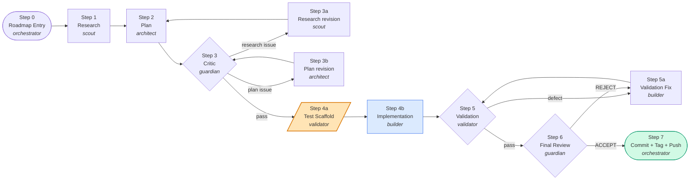
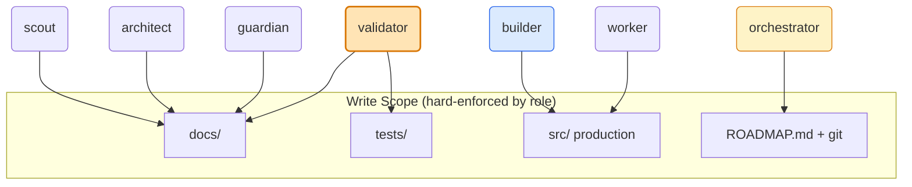
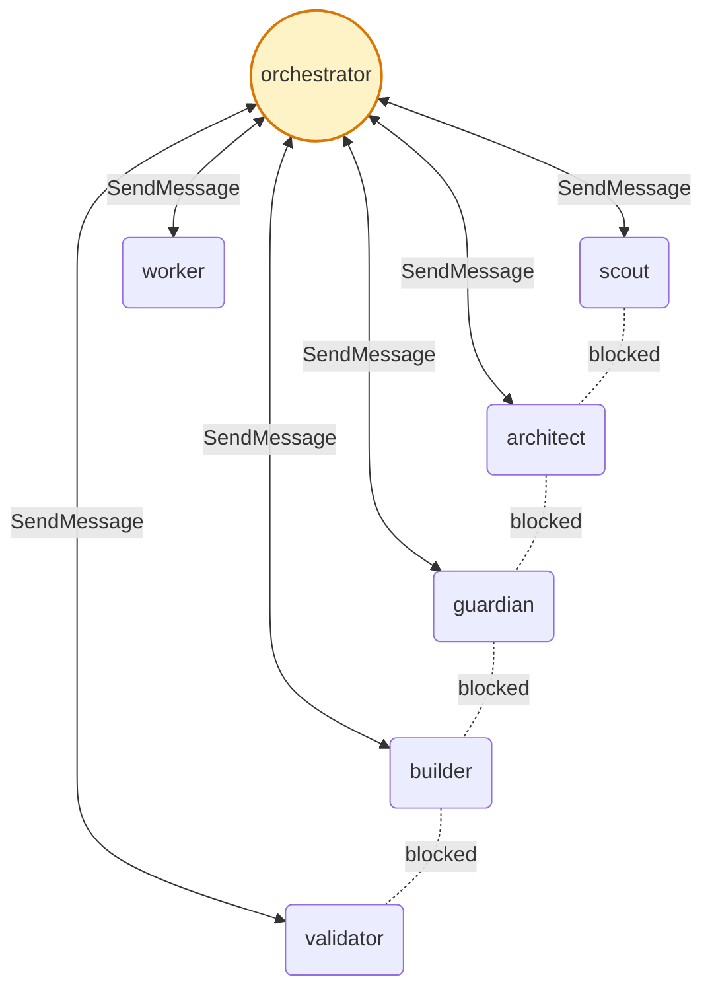

<div align="center">


# cadence

**A `CLAUDE.md`-driven harness that turns one Claude Code agent into a 6-role team running outside-in TDD against a phase-gated roadmap.**

*No binaries. No daemons. No SDK. Just one markdown file and a directory of agent personas.*

[English](README.md) · [中文](README.zh.md)

</div>

---

## The problem

Claude Code at high effort is fast, but left to itself it tends to:

- Ship a 600-line PR for a 50-line ask.
- Write tests *after* the implementation — quietly aligning the assertions to whatever it just produced.
- Treat every GitHub issue as a green light to start coding.
- "Fix" things you didn't ask it to fix, then revert your work in the cleanup.
- Drop a `child_process` call into a tool layer that was supposed to be shell-free.

System prompts and memory don't fix this. The agent needs **structural** constraints — gates it cannot skip, write permissions it cannot widen, and a handoff discipline that catches drift before it cascades.

## What this is

A single `CLAUDE.md` and six agent definitions, designed to be **dropped into the root of any repo**. The file teaches Claude how to behave as a team of six specialists led by an orchestrator, walking every non-trivial task through gates `0 → 7` of a Phase Gate Matrix.

The harness is entirely declarative. There is no runtime, no plugin, no Node package. Claude Code reads `CLAUDE.md` and the agents in `.claude/agents/`, and that's the whole thing.

### Key ideas

| | |
|---|---|
| **Outside-in TDD** | The `validator` writes failing test scaffolds **before** the `builder` writes any production code. The test file IS the contract. |
| **Write-permission isolation** | `builder` cannot write tests. `validator` cannot edit production code. `scout` / `architect` / `guardian` only write docs. Routes by role, not by judgment. |
| **Phase Gate Matrix** | Non-simple work runs steps 0 → 7 in order. No step starts until the previous passes. No phase starts until the previous commits. |
| **Handoff discipline** | The orchestrator must `Read` every deliverable end-to-end and quote a specific finding when dispatching the next agent. Hand-waving is a violation. |
| **No lateral chatter** | All agent ↔ agent messaging routes through the orchestrator. No two specialists collude. |
| **Issue triage as gate** | A new GitHub issue is not a phase. It passes scout-reproduction → guardian-evaluation → orchestrator-decision before it can become work. |

---

## Requirements

> **⚠️ This harness REQUIRES `--dangerously-skip-permissions`.**
>
> A single phase fires dozens of tool calls across gates 0 → 7. If every call hits a permission prompt, the matrix collapses into a babysitting session and the value proposition — *leave the agent running unattended through gates* — disappears. **Run with permissions bypassed or don't bother.**
>
> The harness is designed around this. The lifted guardrails are replaced by **structural** ones that the agent cannot bypass through clever reasoning:
>
> - **Write-scope isolation by role** — `validator` cannot edit production code; `builder` cannot write tests; specialists cannot write outside `docs/`. Enforced via the agent definitions in `.claude/agents/`.
> - **No-bash boundary at the tool layer** — §1 Product Contract forbids `child_process` in tool implementations; CI lint catches violations.
> - **Orchestrator handoff discipline** — every step transition requires the orchestrator to `Read` the prior deliverable end-to-end and quote a finding in the dispatch prompt.
> - **No lateral chatter** — specialists talk only to the orchestrator; no two agents collude to widen scope.
>
> If you're not comfortable running with permissions bypassed, this harness is not for you. Use Claude Code's default approval flow instead.

**Strongly recommended:** run inside a `tmux` session. A phase commonly loops Steps 4b ↔ 5 ↔ 5a three to five rounds before converging. `tmux` lets you detach, sleep, eat lunch, and reattach to a finished phase commit — and it's also the sanctioned way to drive *another* Claude session end-to-end for real-agent live verification (see `Code & Test Policy` in [CLAUDE.md](CLAUDE.md)).

## Quickstart

```bash
# 1. Drop CLAUDE.md into your repo root
curl -O https://raw.githubusercontent.com/kyoubelyu/claude-cadence/main/CLAUDE.md

# 2. (Optional) Copy the agent definitions
mkdir -p .claude/agents
# ... copy scout.md / architect.md / guardian.md / builder.md / validator.md / worker.md

# 3. Replace §Project Scope with one precise paragraph describing the product, users, and core boundaries

# 4. Launch Claude Code inside tmux with permissions bypassed (required)
tmux new -s claude
claude --dangerously-skip-permissions
```

### One-liner to drive Claude inside a pane

```bash
tmux new-session -d -s mai
tmux send-keys -t mai 'claude --dangerously-skip-permissions' Enter
tmux send-keys -t mai 'auto mode' Enter
tmux attach -t mai
```

The agent reads `CLAUDE.md`, sees the `auto mode` directive, re-reads `ROADMAP.md`, picks up the in-progress phase, and walks the gates.

---

## The Phase Gate Matrix



The orange node is the load-bearing one: **tests are written before the production code that satisfies them.**

### Step 4a → 4b in detail

| Phase | `validator` | `builder` |
|---|---|---|
| **4a** (validator first) | Writes test scaffolds — compileable, all-failing, named per the plan's testable behaviors. Assertion bodies are `TODO`. Publishes the *test contract*. | Idle. |
| **4b** (builder next) | Idle. | Writes production code. Goal: scaffolds compile + execution reaches the assertion-TODO branch. Does NOT need to satisfy TODO assertions yet. |
| **5** (validator returns) | Fills assertion bodies + adds edge cases + runs the full suite. Publishes the *test report*. | Idle. |
| **5a** (builder fixes) | Idle. | Production-only fixes for defects validator surfaced. Loops with Step 5 until clean. |

**Why this works.** When the validator writes assertions *after* seeing the builder's implementation, the assertions drift toward whatever the implementation happens to do. Pre-writing the scaffold pins the contract. Builder/spec mismatch surfaces at Step 4b — not at Step 5a, five rounds and a context-window later.

---

## Write-permission matrix



`validator` is the **sole** owner of test files. If `builder` decides during Step 4b that a new test is needed, it must hand back to the orchestrator via `SendMessage` — not write the test itself. This blocks the most common Claude failure mode in TDD: the implementer "rounding out" the test suite as it finds new edge cases, gradually re-aligning tests to its own implementation.

---

## Communication topology



Every specialist talks **only** to the orchestrator. No lateral chatter. The orchestrator must `Read` the inbound deliverable end-to-end and quote a specific finding when dispatching outbound — proving the handoff was *read*, not just *acknowledged*.

---

## Code cleanliness (the non-process half)

The Phase Gate Matrix governs *process*. §1 Coding Behavior in `CLAUDE.md` governs the code itself. The harness is opinionated about this on purpose — Claude at high effort needs the rails.

### Think before coding

> Don't assume. Don't hide confusion. Surface tradeoffs.

State assumptions explicitly. If a simpler approach exists, say so. If something is unclear, stop and name what's confusing rather than guess.

### Simplicity first

> Minimum code that solves the problem. Nothing speculative.

- No features beyond what was asked.
- No abstractions for single-use code.
- No "flexibility" or "configurability" that wasn't requested.
- No error handling for impossible scenarios.
- If you write 200 lines and it could be 50, rewrite it.

The mental check: *would a senior engineer say this is overcomplicated?* If yes, simplify.

### Surgical changes

> Touch only what you must. Clean up only your own mess.

- Don't "improve" adjacent code, comments, or formatting.
- Don't refactor things that aren't broken.
- Match existing style, even if you'd do it differently.
- Remove imports/variables/functions that *your* changes orphaned. Leave pre-existing dead code alone — mention it instead of deleting it.

Every changed line must trace directly to the user's request. **Do not revert or overwrite user work** the agent did not author, unless asked.

### File size

Source files **≤ 800 lines**. Split before a planned change would push over. Generated files, lockfiles, vendored deps, snapshots, build artifacts, and data fixtures are exempt.

### Goal-driven execution

Transform tasks into verifiable goals:

- "Add validation" → "Write tests for invalid inputs, then make them pass."
- "Fix the bug" → "Write a test that reproduces it, then make it pass."
- "Refactor X" → "Ensure tests pass before and after."

Strong success criteria let the agent loop independently. Weak criteria ("make it work") force constant clarification.

### Product contract

The published surface — CLI entrypoint, library exports, system prompt structure, tool inventory, on-disk schemas — is the **operator-facing product contract**. Tool name + parameter schema changes require a major version bump. On-disk path or schema changes go through the Phase Gate Matrix with a migration plan. Any load-bearing security boundary (no-bash, capability allowlist, credential isolation) is a Phase Gate item, never a `worker` task.

---

## Repo layout

```
your-repo/
├── CLAUDE.md                       # The harness. Keep §Project Scope to one concise paragraph.
├── ROADMAP.md                      # Active tasks plus one-line closed-task Change History.
├── .claude/
│   └── agents/
│       ├── scout.md                # Step 1, 3a — research
│       ├── architect.md            # Step 2, 3b — plan
│       ├── guardian.md             # Step 3, 6 — critic + final review
│       ├── builder.md              # Step 4b, 5a — production code only
│       ├── validator.md            # Step 4a, 5 — test scaffolds + reports
│       └── worker.md               # outside the matrix — simple tasks
└── docs/
    ├── phase-1-research.md         # scout (Step 1)
    ├── phase-1-plan.md             # architect (Step 2) — §5 lists testable behaviors
    ├── phase-1-critics.md          # guardian (Step 3)
    ├── phase-1-test.md             # validator (Step 4a contract + Step 5 report)
    └── phase-1-review.md           # guardian (Step 6)
```

`CLAUDE.md` and `ROADMAP.md` live at the repo root. Everything else is convention — the harness only requires the two markdown files at the root and (optionally) the agents directory.

---

## When *not* to use this

This harness has a strong personality. It's worth your time when:

- The codebase has a real product contract (CLI, library API, on-disk schema) that breakage cascades from.
- The work spans hours-to-days per phase and you want to leave the agent running unattended.
- You've been burned before by Claude "rounding out" tests to match a flawed implementation.
- You're running with `--dangerously-skip-permissions` and want structural compensating controls.

It's overkill when:

- You're scripting a one-off, throwaway, or research notebook.
- The repo has no test framework and you don't plan to add one.
- You want Claude to "just hack" — the gates will feel like dead weight.

---

## FAQ

**Does this work with Claude Code's built-in subagents?**
Yes. The six agent files in `.claude/agents/` *are* subagents. The harness is built on the standard subagent mechanism, not a replacement for it. The orchestrator is the top-level Claude Code session; specialists are spawned via the `Agent` tool.

**Per-agent effort levels?**
At the time of writing Claude Code exposes one global `effortLevel` knob. The agent files declare per-agent effort as *design intent* — encode it in agent frontmatter once upstream ships per-agent effort. Until then, all six agents inherit the global setting.

**Why is `--dangerously-skip-permissions` required, not optional?**
Because approval prompts kill the loop. A 7-step gated phase fires dozens of tool calls; prompting on each turns the harness from "leave it running" into "babysit it" — and at that point the gates buy you nothing you couldn't get with manual review. The harness *replaces* per-call approval with **structural** controls: write-scope isolation per role (validator can't touch production code, builder can't touch tests), the no-bash boundary in §1.8, and the orchestrator's mandatory `Read` + quote-a-finding handoff discipline. If you don't trust those controls enough to run with bypass on, don't run the harness — fall back to Claude Code's default flow.

**What if a phase blocks halfway through?**
The orchestrator inserts a *blocker phase* into `ROADMAP.md` and the matrix walks the blocker through gates 0 → 7 like any other phase. No working around blockers without a phase entry — that's Hard Rule 4.

**Do I have to use all six agents?**
No. The smallest viable harness is `CLAUDE.md` + `worker.md` for simple work + `architect.md` + `builder.md` + `validator.md` for everything else. `scout` and `guardian` add a research + critic loop that pays off on contracts that break loudly when wrong; skip them for greenfield prototyping.

**Where does the auto-commit at Step 7 commit to?**
Whatever branch you're on. The harness doesn't open PRs. If you're on `main`, it commits + tags + pushes directly. If you want a PR flow, switch to a feature branch before `auto mode` and the same Step 7 sequence applies (minus the tag push, by convention).

---

## License

Apache-2.0. Use it, fork it, embed it. If you ship a derivative harness, the patent clause means we don't have to worry about each other.

---

<div align="center">

*Working if: fewer unnecessary changes in diffs, fewer rewrites due to overcomplication, clarifying questions come before implementation rather than after mistakes, every phase ends with a clean commit, every load-bearing security boundary holds across every PR.*

</div>
