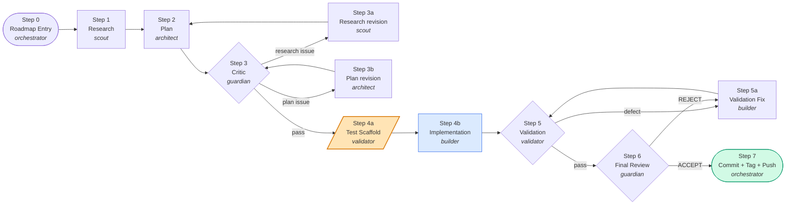
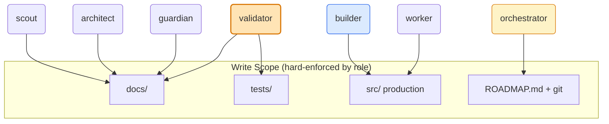
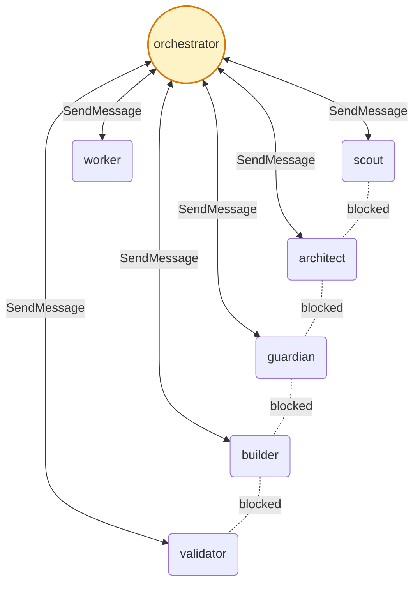

<div align="center">

# cadence

**一个由 `CLAUDE.md` 驱动的 harness — 让一个 Claude Code 智能体扮演六个角色,沿着 phase-gated roadmap 跑 outside-in TDD。**

*没有二进制。没有 daemon。没有 SDK。只有一份 markdown + 一个 agent 目录。*

[English](README.md) · [中文](README.zh.md)

</div>

---

## 痛点

Claude Code 在高 effort 下速度很快,但放任不管时常常会:

- 为一个 50 行的需求交一份 600 行的 PR。
- 在实现**之后**才写测试 — 默默把 assertion 对齐到它刚写出的代码上。
- 把每一个 GitHub issue 都当作开工的绿灯。
- "顺手"修一些你没让它修的东西,然后在 cleanup 里把你的工作回退掉。
- 在原本不该有 shell-out 的 tool 层悄悄塞一个 `child_process`。

system prompt 和 memory 解决不了这些问题。Agent 需要的是**结构性**约束 — 它跳不过去的 gate、扩不开的写权限、能在漂移变成级联之前就把它卡住的 handoff 纪律。

## 这是什么

一份 `CLAUDE.md` 加六个 agent 定义文件,**放到任何 repo 的根目录就能用**。这份文件教会 Claude 像一支由 orchestrator 领导的六人专家团队那样工作,把每一项非琐碎的任务推过 Phase Gate Matrix 的 `0 → 7` 关。

Harness 是完全声明式的。没有 runtime、没有 plugin、没有 Node 包。Claude Code 读 `CLAUDE.md` 和 `.claude/agents/` 下面的角色文件 — 全部就这些。

### 核心想法

| | |
|---|---|
| **Outside-in TDD** | `validator` 在 `builder` 写任何生产代码**之前**先写好失败的测试脚手架。测试文件就是契约。 |
| **按角色隔离写权限** | `builder` 不能写测试;`validator` 不能改生产代码;专家们都只能写 `docs/`。靠角色路由,不靠判断力。 |
| **Phase Gate Matrix** | 非琐碎工作按 0→7 顺序跑。上一步不过,下一步不开始。上一个 phase 不 commit,下一个 phase 不启动。 |
| **Handoff 纪律** | Orchestrator 在每次步骤交接时必须 `Read` 完整产物,且在派发下一个 agent 时**引用一个具体 finding**。打哈哈视为违规。 |
| **没有横向串通** | 所有 agent ↔ agent 通信都走 orchestrator。两个专家不能私下勾兑。 |
| **Issue 三级 triage** | 新 GitHub issue 不会自动变成 phase。必须经过 scout-复现 → guardian-评估 → orchestrator-决策,才能成为工作。 |

---

## 运行要求

> **⚠️ 这套 harness 必须搭配 `--dangerously-skip-permissions` 使用。**
>
> 一个 phase 会跨 0→7 道 gate 触发几十次 tool 调用。如果每一次都弹权限确认,矩阵就坍缩成"盯屏 session",harness 的核心价值 — *让 agent 无人值守地跑过 gates* — 就消失了。**要么用 bypass 跑,要么别用。**
>
> Harness 在设计上就预设了这点。被卸掉的权限审批由 agent 无法绕过的**结构性**控制替代:
>
> - **按角色隔离写权限** — `validator` 不能改生产代码;`builder` 不能写测试;专家们写不出 `docs/` 之外的东西。由 `.claude/agents/` 里的角色定义强制。
> - **Tool 层无 bash 边界** — §1 Product Contract 禁止 tool 实现里使用 `child_process`;CI lint 检出违规。
> - **Orchestrator handoff 纪律** — 每次步骤切换都要求 orchestrator 完整 `Read` 上一份产物,并在派发提示里引用一个具体 finding。
> - **没有横向串通** — 专家只跟 orchestrator 说话;没有两个 agent 能合谋扩大范围。
>
> 如果你不放心带 bypass 跑,这套 harness 不适合你。请用 Claude Code 默认的审批流程。

**强烈建议:** 在 `tmux` session 里跑。一个 phase 常常会在 Steps 4b ↔ 5 ↔ 5a 之间循环三到五轮才收敛。`tmux` 让你 detach、睡个觉、吃个午饭,回来 reattach 到一个已经 commit 完的 phase — 它也是把*另一个* Claude session 端到端驱动起来做 real-agent live verification 的官方姿势(详见 [CLAUDE.md](CLAUDE.md) 的 `Code & Test Policy`)。

## 快速开始

```bash
# 1. 把 CLAUDE.md 放到你的 repo 根目录
curl -O https://raw.githubusercontent.com/kyoubelyu/claude-cadence/main/CLAUDE.md

# 2.(可选)拷贝 agent 定义
mkdir -p .claude/agents
# ... copy scout.md / architect.md / guardian.md / builder.md / validator.md / worker.md

# 3. 定制 CLAUDE.md 顶部的 §Project Scope

# 4. 在 tmux 里启动 Claude Code,带上 bypass permissions(必需)
tmux new -s claude
claude --dangerously-skip-permissions
```

### 一行命令让 Claude 在 pane 里跑起来

```bash
tmux new-session -d -s mai
tmux send-keys -t mai 'claude --dangerously-skip-permissions' Enter
tmux send-keys -t mai 'auto mode' Enter
tmux attach -t mai
```

Agent 会读 `CLAUDE.md`,看到 `auto mode` 指令,重读 `ROADMAP.md`,接着进行中的 phase,然后开始走 gate。

---

## Phase Gate Matrix



橙色那个节点是承重的:**测试在能让它通过的生产代码之前写好。**

### Step 4a → 4b 拆解

| 阶段 | `validator` | `builder` |
|---|---|---|
| **4a**(validator 先) | 写测试脚手架 — 可编译、全部失败、按 plan 的 testable behaviors 命名。Assertion 内容是 `TODO`。发布*测试契约*。 | 待命。 |
| **4b**(builder 后) | 待命。 | 写生产代码。目标:脚手架能编译,执行能到达 assertion-TODO 分支。**还不需要让 TODO 的 assertion 通过**。 |
| **5**(validator 回来) | 填 assertion + 加 edge case + 跑完整套件。发布*测试报告*。 | 待命。 |
| **5a**(builder 修) | 待命。 | 针对 validator 报的 defect 修生产代码。和 Step 5 循环直到干净。 |

**为什么有效。** 当 validator 在看到 builder 实现*之后*才写 assertion,assertion 会不自觉地朝实现的实际行为漂移。脚手架先写好就把契约钉死了。Builder/spec 的不匹配在 Step 4b 就暴露 — 而不是在 Step 5a 第五轮、context window 已经塞满之后才暴露。

---

## 写权限矩阵



`validator` 是测试文件**唯一**的所有者。如果 `builder` 在 Step 4b 觉得需要新增测试,它必须用 `SendMessage` 交回 orchestrator — 不能自己写。这堵住了 Claude 做 TDD 时最常见的失败模式:实现者一边发现新 edge case 一边"顺手补全"测试套件,逐步把测试再次对齐到它自己的实现上。

---

## 通信拓扑



每个专家**只**跟 orchestrator 对话,没有横向串通。Orchestrator 必须 `Read` 完整的入站产物,出站派发时必须引用具体 finding — 证明这次 handoff 是被*读过*的,不只是*收到*。

---

## 代码洁癖(流程之外的另一半)

Phase Gate Matrix 治理*流程*。`CLAUDE.md` 的 §1 Coding Behavior 治理代码本身。Harness 在这件事上故意有立场 — Claude 在高 effort 下需要明确的护栏。

### 写代码之前先想

> 不要假设。不要藏起困惑。把 tradeoff 摆出来。

显式说出假设。如果有更简单的做法,说出来。如果有不清楚的地方,停下,说清楚哪里不清楚,而不是猜。

### 简洁优先

> 解决问题的最少代码。不做投机。

- 没要的功能不做。
- 一次性使用的代码不做抽象。
- 没要求的"灵活性"或"可配置性"不做。
- 不可能发生的场景不做错误处理。
- 写了 200 行能压到 50 行,就重写。

心理测试:*"一个资深工程师会觉得这过度设计了吗?"* 会就简化。

### 外科式改动

> 只动你必须动的。只清你自己的烂摊子。

- 别"顺手改善"相邻的代码、注释、格式。
- 没坏的别重构。
- 跟现有代码风格保持一致,即便你不喜欢那种风格。
- 你的改动孤立掉的 import / 变量 / 函数,删掉。预先就存在的 dead code 别动 — 指出来就行,别删。

每一行改动都要直接追溯到用户的请求。**不要回退或覆盖用户自己写的内容**,除非用户要求。

### 文件大小

源文件 **≤ 800 行**。如果一个计划中的改动会把它推过去,先拆。生成文件、lockfile、vendored deps、snapshot、build artifact、数据 fixture 豁免。

### 目标驱动执行

把任务变成可验证的目标:

- "加校验" → "为非法输入写测试,然后让它们通过。"
- "修这个 bug" → "先写一个能复现它的测试,然后让它通过。"
- "重构 X" → "确保重构前后测试都通过。"

强成功标准让 agent 能独立 loop。弱标准("跑起来就行")会逼着你不停澄清。

### 产品契约

发布出去的 surface — CLI 入口、库 export、system prompt 结构、tool inventory、磁盘 schema — 是**对操作者的产品契约**。Tool 名称 + 参数 schema 的改动要走 major version bump。磁盘路径 / schema 的改动走 Phase Gate Matrix 加迁移方案。任何承重的安全边界(no-bash、capability allowlist、credential 隔离)都是 Phase Gate 决策,绝不是 `worker` 任务。

---

## Repo 布局

```
your-repo/
├── CLAUDE.md                       # Harness 本体。单文件。定制 §Project Scope。
├── ROADMAP.md                      # 每个 phase 的状态、gate、blocker、下一步。
├── .claude/
│   └── agents/
│       ├── scout.md                # Step 1, 3a — 研究
│       ├── architect.md            # Step 2, 3b — 规划
│       ├── guardian.md             # Step 3, 6 — 批评 + 终审
│       ├── builder.md              # Step 4b, 5a — 只写生产代码
│       ├── validator.md            # Step 4a, 5 — 测试脚手架 + 报告
│       └── worker.md               # 矩阵之外 — 琐碎任务
└── docs/
    ├── phase-1-research.md         # scout (Step 1)
    ├── phase-1-plan.md             # architect (Step 2) — §5 列出 testable behaviors
    ├── phase-1-critics.md          # guardian (Step 3)
    ├── phase-1-test.md             # validator (Step 4a 契约 + Step 5 报告)
    └── phase-1-review.md           # guardian (Step 6)
```

`CLAUDE.md` 和 `ROADMAP.md` 在 repo 根目录。其他都是约定 — harness 只要求根目录的两份 markdown,加(可选的)agent 目录。

---

## 什么时候**别用**这套

这套 harness 个性很强。在以下场景下值得花时间:

- 代码库有真实的产品契约(CLI、库 API、磁盘 schema),坏了会级联。
- 单个 phase 跨小时到天,你想让 agent 无人值守地跑。
- 你被 Claude "顺手补全"测试以适配错实现坑过。
- 你在用 `--dangerously-skip-permissions` 跑,想要结构性的补偿控制。

这些场景下纯属过度工程:

- 一次性脚本、扔了不要的代码、研究 notebook。
- Repo 没有测试框架且不打算加。
- 你想让 Claude "快糙猛地干"— gate 会让你觉得像负重。

---

## FAQ

**这能跟 Claude Code 内置的 subagent 一起用吗?**
能。`.claude/agents/` 里这六份 agent 文件*就是* subagent。Harness 建立在标准 subagent 机制上,不是替代品。Orchestrator 是顶层 Claude Code session,专家是通过 `Agent` tool 派出的子进程。

**Per-agent effort level 怎么搞?**
写这文档时,Claude Code 只暴露一个全局 `effortLevel` 旋钮。Agent 文件里的 per-agent effort 是*设计意图* — 等上游放出 per-agent effort 后,把它编进 agent frontmatter 即可。在那之前,六个 agent 都继承全局设置。

**为什么 `--dangerously-skip-permissions` 是必需的,不是可选?**
因为审批弹窗会杀掉 loop。一个 7 步 gate 的 phase 会触发几十次 tool 调用;每一次都弹,harness 就从 "leave it running" 退化成 "babysit it" — 到那个时候 gate 给你的价值,你直接人工 review 就有了。Harness 用**结构性**控制*替代*了 per-call 审批:按角色隔离写权限(validator 不能动生产代码,builder 不能动测试)、§1.8 的 no-bash 边界、以及 orchestrator 强制的 `Read` + 引用 finding 的 handoff 纪律。如果你不放心带 bypass 跑,就别跑 harness — 退回 Claude Code 默认流程。

**Phase 跑到一半卡住了怎么办?**
Orchestrator 在 `ROADMAP.md` 里插入一个 *blocker phase*,矩阵把这个 blocker 当作任何其他 phase 一样跑 0→7。**不能不写 phase 就绕开 blocker** — 这是 Hard Rule 4。

**必须用全部六个 agent 吗?**
不用。最小可用 harness 是 `CLAUDE.md` + `worker.md` 处理琐碎任务 + `architect.md` + `builder.md` + `validator.md` 处理其他。`scout` 和 `guardian` 加了一对研究 + 批评回路,在错了会出大事的契约场景下回报丰厚;绿地原型可以先跳过。

**Step 7 auto-commit 提交到哪个分支?**
你当前所在的分支。Harness 不开 PR。如果你在 `main`,它直接 commit + tag + push 到 `main`。想要 PR 流程,在 `auto mode` 之前切到 feature 分支,Step 7 序列同样适用(按惯例去掉 tag push)。

---

## License

Apache-2.0。用它、fork 它、嵌入它。如果你做了衍生 harness,patent clause 让我们俩都不用担心彼此。

---

<div align="center">

*跑通了的标志:diff 里多余改动变少;因为过度设计被推翻重写变少;澄清问题在实现*之前*被问而不是在出错*之后*被问;每个 phase 都干净 commit 收尾;每条承重的安全边界在每个 PR 里都没破。*

</div>
